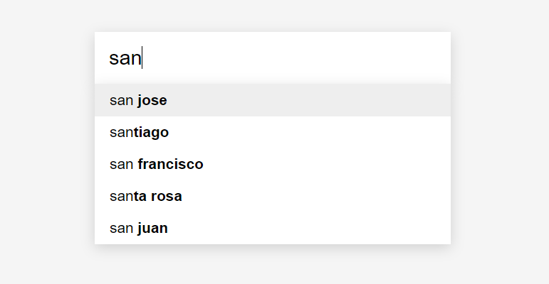

# react-autocomplete
A React component for an autocomplete text input box. Once the user starts typing, filtered results will be listed, which can then be selected via arrow keys + enter or mouse click.

## Usage
Clone this repository locally, and run `npm start`. Go to `localhost:3000` in your browser.

## In the future
Given more time, here are some features I would want to implement:

- A couple more UI tweaks, such as a "No results to show" message, and a loading icon if fetching results is taking too long. Some indicators to show that using the up and down arrow keys is an option.
- Ability to request remote data for results, along with some kind of caching to speed it up
- Contain the results in a scrollbox so that they don't expand down the whole page
- Currently, the results are re-filtered on every keypress. In the future when filtering results is more costly and time-consuming, it may be better to only filter the results every 100ms or so, since the uesr may type much faster.

## Packages used
This project was bootstrapped with [Create React App](https://github.com/facebookincubator/create-react-app).
